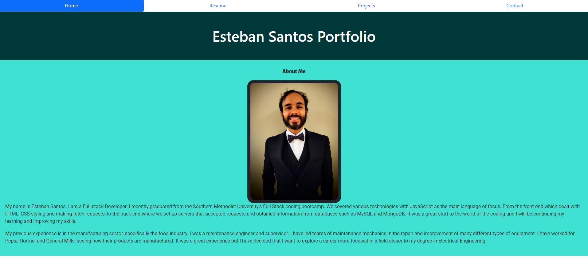

 #  E. Santos Portfolio 

  ## Description:

This is my portfolio using React as a basis and deployed on Heroku.

  ## Table of Contents:
  * [Description](#Description)

  * [Installation Instructions](#Installation)

  * [Usage](#Usage)
  
  * [License](#License)

  * [Contributors](#Contributors) 

  * [Test Instructions](#Test_Instructions)

  * [Website](#Website)

  * [Technologies-Used](#Technologies-Used)
  
  * [Questions](#Contributors)
    
  ## Installation
    None  

  ## Usage
    None

  ## License:
  This project is covered under the following license. See link for more information.
  If empty, no license is being used.
    
    MIT
    https://opensource.org/licenses/MIT

  ## Contributors: 
    Myself and others depending on project

  If you would like to contribute please follow:

    None

  ## Test Instructions:
    None

  ## Website:
  Github Repository: https://github.com/PRicoSaint/esantos-portfolio

  Deployed Site here: 
    https://shrouded-waters-22536.herokuapp.com/

  Screenshot:
  

Screenshot will be found here

  
  ## Technologies-Used:
  
    HTML
	CSS
	Javascript
	node.js
	react
    MongoDB

## Any questions/suggestions/critique?
Please find me at:
https://github.com/PRicoSaint/

I can be contacted through email:
santosesteban09@gmail.com

